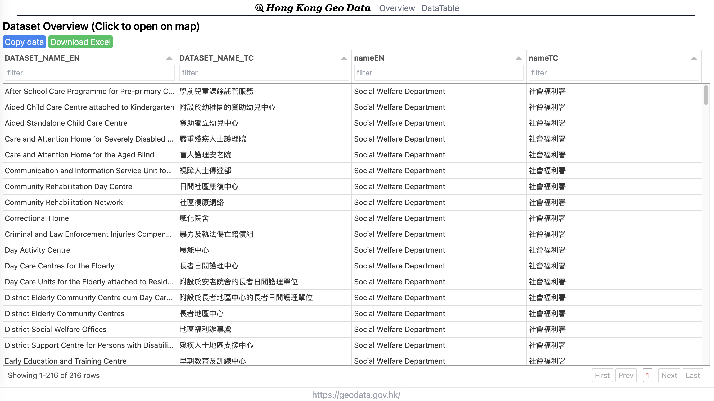
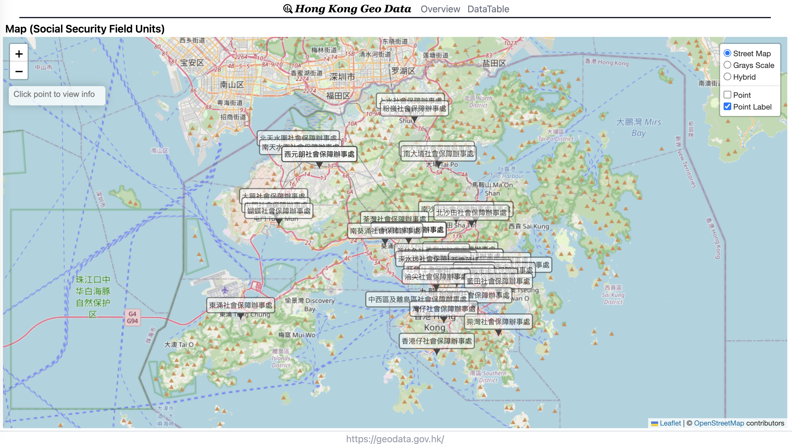

## Tools to scraping Hong Kong GEO data API info and display on leaflet map 

> https://hongkong-government-geodata.netlify.app/





## Netlify setup for auto build

### Changing build setting
Including python process to scraping latest data on build, add `netlify.toml` at root to override netlify setting.

```sh
[build]
  command = "python get_hkgeo-data.py && npm run build"
  publish = "build"

[context.production]
  environment = { PYTHON_VERSION = "3.8" }
```
### Config daily rebuild
1. Create `Build hooks` netlify site setting, then you will have a post url link for trigger build.

   > Settings > Build & Deploy > Continuous Deployment > Build hooks

2. Create daily webhook job at https://ifttt.com/

Reference : https://answers.netlify.com/t/scheduling-builds-and-deploys-with-netlify/2563/9

## Get geojson from https://geodata.gov.hk/
Simply use case, just run python script for  scraping geojson files to /static/json
```sh
python get_hkgeo-data.py
```

## Local debugging

Web using SvelteKit to bulid
```sh
# install package
npm install

 # local test
npm run dev 
```

